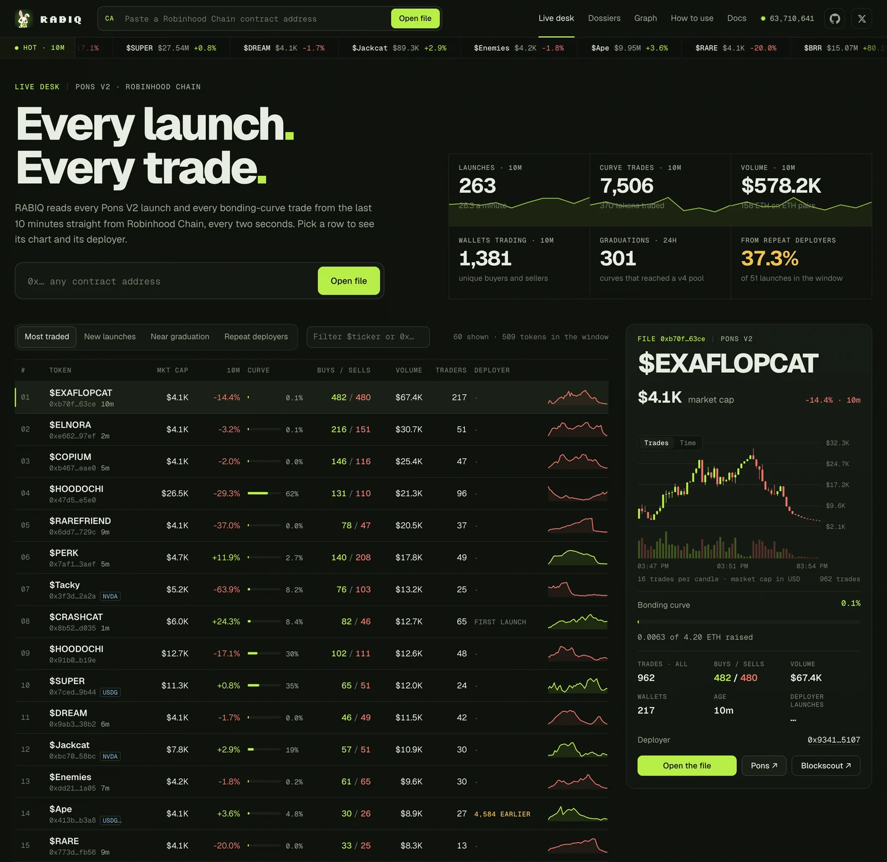
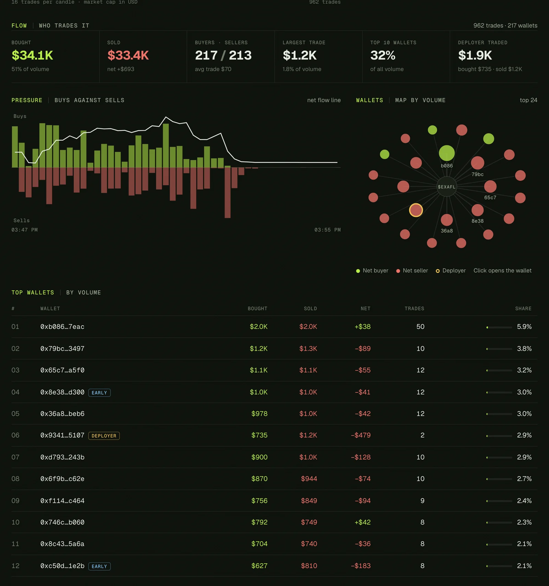

<p align="center">
  
</p>

<p align="center">
  <a href="https://rabiq.vercel.app"></a>
</p>

<p align="center">
  <a href="https://github.com/0xmfox/rabiq/actions/workflows/ci.yml"></a>
  <a href="https://github.com/0xmfox/rabiq/releases"></a>
  
  
  
  <a href="LICENSE"></a>
</p>

<p align="center">
  <strong>Every deployer has a history.</strong><br/>
  Token dossiers and deployer memory for Robinhood Chain.
</p>

<p align="center">
  <a href="https://rabiq.vercel.app"><strong>Live app</strong></a> ·
  <a href="#the-number">The number</a> ·
  <a href="#sixty-seconds">Sixty seconds</a> ·
  <a href="#live-desk">Live desk</a> ·
  <a href="#token-analytics">Token analytics</a> ·
  <a href="#the-dossier">The dossier</a> ·
  <a href="#deployer-memory">Deployer memory</a> ·
  <a href="#quick-start">Quick start</a> ·
  <a href="#cli">CLI</a> ·
  <a href="#faq">FAQ</a> ·
  <a href="https://x.com/0xMfox">X / @0xMfox</a>
</p>

---

## Why RABIQ

Pons V2 ships a new token on Robinhood Chain every few seconds. You look at a CA, open the repo, read the launch post and decide to wait. Two days later the same deployer launches again, and you have to find everything a second time.

That happens a lot. Across 458,223 Pons V2 launches, **43.9%** of the launches made by wallets came from a wallet that had already launched a token before ([how we counted](#the-number)).

RABIQ turns every contract address into a **dossier**: the on-chain facts, your thesis, what you checked, the question you stopped at and your decision. Open the CA again and RABIQ shows **what changed since your last check**. Dig a new CA from a deployer you already studied and RABIQ puts your old notes in front of you.

### Keep what you found

Traders drop most trench research into a chat, a screenshot or nowhere. RABIQ pins each investigation to its contract address, links investigations that share a deployer, fee recipient or repository, and turns a finished dossier into a link another researcher can pick up.

## Current build

| Engine | Status | What is in the repo |
| --- | --- | --- |
| Live site | **WORKING** | [rabiq.vercel.app](https://rabiq.vercel.app): a landing page that opens a case file on the newest Pons V2 launch, then the app |
| Launch census | **WORKING** | `scripts/landing-data.ts` reads every `TokenLaunched` event, tells wallets from contracts by bytecode and counts repeat launchers |
| Token dossier | **WORKING** | Paste a CA → one dossier per chain + address, so identical tickers never mix |
| On-chain facts | **WORKING** | Pons V2 factory `getLaunchedToken` → deployer, fee recipient, phase (curve, swept, graduated, rescued), creator tax; curve price and progress from `getReserves` |
| Deployer memory | **WORKING** | Every `TokenLaunched` by the same deployer across the whole Pons V2 history, in one indexed log query; RABIQ highlights tokens already in your burrow |
| Deployer constellation | **WORKING** | The deployer's launches drawn around it on every dossier: this token, graduated tokens, other launches; drag to rearrange, click to open |
| RABIQ remembers | **WORKING** | Opening a dossier surfaces connected dossiers with their thesis, decision and first open question |
| Since last check | **WORKING** | FDV and liquidity moves, curve → pool graduation, fee recipient change, new commits with a compare link, new launches by the deployer |
| Strings | **WORKING** | Dossiers link through a shared deployer, fee recipient or GitHub repo (**confirmed**) or through your own notes (**hypothesis**) |
| Graph | **WORKING** | All dossiers as draggable nodes and connections |
| Publish / Save to my brain | **WORKING** | A dossier is packed into the link itself. Status, reason and notes stay private unless you opt in |
| Live desk | **WORKING** | Every Pons V2 launch and every bonding-curve trade of the last ten minutes, read every two seconds: market cap, curve progress, buys and sells, volume, wallets, sparkline and the deployer's earlier launches per token; sorted by most traded, new launches, near graduation or repeat deployers |
| Token analytics | **WORKING** | On every Pons V2 dossier: all-time high, all-time volume, trades and wallets; bought vs sold, buyers vs sellers, largest trade, top-10 wallet share, whether the deployer traded; a buy/sell pressure chart with net flow, a wallet map and a top wallets table tagged Deployer, Fee recipient and Early |
| Charts | **WORKING** | Market cap candles from every `CurveBuy` / `CurveSell` since launch, continued with Uniswap v4 `Swap` events after graduation; trade-count or time candles |
| Quote assets | **WORKING** | Launches paired with USDG, cbBTC or tokenized stocks are priced in their own asset (decimals read on-chain, USD from DexScreener) |
| Ticker tape | **WORKING** | The most traded tokens of the last ten minutes, on every page |
| How to use + Docs | **WORKING** | [rabiq.vercel.app/#/how](https://rabiq.vercel.app/#/how) and [#/docs](https://rabiq.vercel.app/#/docs): every data source, contract and formula |
| Markdown export | **WORKING** | Any dossier as an Obsidian-friendly note with frontmatter; all dossiers as JSON |
| CLI | **WORKING** | `rabiq dig`, `rabiq recall`, `rabiq demo` over a folder of Markdown notes |
| Demo dossiers | **WORKING** | Four synthetic dossiers, labelled as demo, no network requests |

## What it looks like

A dossier on a live Pons V2 launch: market cap, all-time high, curve progress, all-time volume, every trade since launch as candles, and the deployer's four launches around it.


| Dossiers as a graph | A published dossier, ready for “Save to my brain” |
| --- | --- |
|  |  |

<sub>Screenshots of the running app on Robinhood Chain mainnet. The tokens are live Pons V2 launches from other builders, used here as research examples. The notes in them are sample research, not recommendations.</sub>

## The number

<p align="center"></p>

`scripts/landing-data.ts` builds the numbers on the landing page from the chain itself:

1. It reads every `TokenLaunched` event from the Pons V2 factory, from the first launch at block 27,027,321 to the current head: 458,223 launches by 252,891 deployer addresses as of block 62,899,527 (14 Sep 2026).
2. It checks the bytecode of every deployer that launched more than once. A single `eth_call` places a small EXTCODESIZE loop at a scratch address with a state override and measures 1,500 addresses per request.
3. Addresses without code count as wallets. So do EIP-7702 accounts, whose only code is the 23-byte delegation designator: a key still controls them. The rest are contracts, such as Multicall3, and their 8,206 launches stay out of the share.
4. A launch counts as "launched before" when the wallet already had an earlier Pons V2 launch: 197,374 of 450,017 wallet launches, or 43.9%.

Single-launch deployers skip the bytecode check. A contract among them would only add a first launch to the denominator, so the share can only come out lower than the true value.

All 458,223 launches, bucketed by block height:

<p align="center"></p>

The same script picks the wallets for **Serial launchers**: the two busiest wallets as launch density over the life of Pons V2, and the four wallets with 6 to 60 launches that graduated the most tokens from the bonding curve.

<p align="center"></p>

```bash
node scripts/landing-data.ts   # rewrites public/landing.json; raw logs are cached in .cache/
```

## Sixty seconds

1. **Dig.** Paste a Robinhood Chain CA into the top bar, or open a token from the **live wire**. RABIQ reads the Pons V2 launch record, the market and every launch by the same deployer.
2. **Write down what you know.** A one-line thesis, two arguments for, one against. Add the launch post and the GitHub repo as sources; RABIQ records the repo head commit on the next check.
3. **Leave a question.** “Does the CLI actually run?” RABIQ marks the first open question **next**.
4. **Decide.** Watching, Researching, In position or Passed, with a reason.
5. **Come back.** Open the same CA tomorrow. **Since your last check** lists what moved: FDV, liquidity, graduation, fee recipient, new commits, new launches.
6. **Meet the deployer again.** Dig a fresh CA from the same wallet. **RABIQ remembers** shows the earlier dossier, its decision and the question you left open.
7. **Publish.** One link carries the thesis, checks, open questions, sources and connected CAs. Whoever opens it can save it into their own burrow and keep going.

## Live desk

<p align="center"></p>

The desk polls Robinhood Chain every two seconds. One `eth_getLogs` request per poll returns every `TokenLaunched`, `PoolGraduated`, `CurveBuy` and `CurveSell` since the previous poll. A new launch lands on screen a few seconds after the public RPC serves its block.

| Part | What it shows |
| --- | --- |
| Tiles | Launches, curve trades, volume and trading wallets in the last ten minutes; graduations in the last 24 hours; the share of launches in the window that came from a deployer with an earlier launch |
| Table | 60 tokens: market cap, 10-minute change, curve progress, buys / sells, volume, traders, the deployer's earlier launches, a sparkline. Tabs: **Most traded**, **New launches**, **Near graduation**, **Repeat deployers**; filter by ticker or address |
| Inspector | The selected token's chart of every trade since launch, curve progress, all-time trades, buys and sells, volume, wallets, age and the deployer's launch count |
| Trade tape and graduations | The latest 40 trades and the latest 30 graduations to a Uniswap v4 pool from the last day |

## Token analytics

Open any Pons V2 token and the dossier reads every curve trade since its launch (and every Uniswap v4 swap after graduation). Everything below comes from those trades; none of it needs another request.

<p align="center"></p>

| Block | What it shows |
| --- | --- |
| Stats | Market cap, all-time high and the distance from it, curve progress, all-time volume, trades with buys and sells, wallets |
| Chart | Market cap candles by trade count or by time, with volume bars; a marker where the curve became a v4 pool |
| Deployer | The deployer's launches as a draggable constellation; graduated tokens in blue |
| Flow | Bought vs sold and net flow, buyers vs sellers, average and largest trade, the top 10 wallets' share of volume, and what the deployer bought and sold |
| Pressure | Buy volume above the line, sell volume below, per time bucket, with the running net flow drawn across |
| Wallets | The 24 busiest wallets as bubbles sized by volume: lime for net buyers, red for net sellers, the deployer ringed; click opens the wallet on Blockscout |
| Top wallets | Bought, sold, net, trades and share for the 12 busiest wallets, tagged **Deployer**, **Fee recipient** or **Early** (among the first 20 trades) |

## The dossier

One dossier per chain and contract address. Two tokens with the same ticker are two different dossiers.

<p align="center"></p>

| Section | What it holds |
| --- | --- |
| **Market and flow** | The live block above: stats, chart, deployer constellation, [token analytics](#token-analytics) |
| **Decision** | `Watching` · `Researching` · `In position` · `Passed`, plus a private reason |
| **Thesis** | What the project is and how you know it |
| **For / Against** | Arguments on each side, one line each |
| **Open questions** | What you still need to verify; RABIQ flags the first unanswered one **next** |
| **Checked** | What you have already verified |
| **Notes** | Markdown with `[[SYMBOL]]` links to other dossiers; addresses become explorer links |
| **Sources** | Launch post, site, GitHub repo; RABIQ snapshots repositories on each check |
| **On-chain facts** | Launchpad, phase, deployer, fee recipient, creator tax, FDV, liquidity, 24h volume, deployer launches, repo head |
| **Connections** | Every string to another dossier, labelled confirmed or hypothesis |
| **Timeline** | When the dossier was opened, status changes, answered questions, detected changes |

Thesis, arguments, questions, checks, notes and sources sit in one **Your research** drawer that stays folded until you write something. **All tokens** at the top goes back to the live desk.

## Deployer memory

For a Pons V2 token, RABIQ reads the factory record with `getLaunchedToken(token)` and gets the **deployer** and **creator fee recipient**. It then collects each `TokenLaunched` event the factory emitted for that deployer, from the first Pons V2 launch (block 27,027,321) to the current head. The deployer is an indexed topic, so the whole history is one `eth_getLogs` request; RABIQ splits the range only when the RPC answers with its 10,000-log cap or a query timeout. One Multicall3 call resolves the symbols for the latest 40 tokens.

Two things happen with that list:

- **In the facts panel**, RABIQ lists the deployer's launches. It highlights the ones you already have a dossier for and links them to your notes.
- **In RABIQ remembers**, RABIQ surfaces any dossier that shares this deployer or fee recipient, with its decision, reason, thesis and first open question.

<p align="center"></p>

## Since last check

Every check stores a snapshot. RABIQ compares the newest snapshot with the previous one using fixed rules:

<p align="center"></p>

| Change | Rule |
| --- | --- |
| FDV move | reported when FDV changed by 5% or more |
| Liquidity move | reported when liquidity changed by 10% or more |
| Market appeared | a market now exists where the previous check found none |
| Graduation | phase moved from the Pons bonding curve to the Uniswap v4 pool |
| Fee recipient change | the creator fee recipient address is different |
| New commits | a tracked repository head moved; the entry links to the GitHub compare view |
| New launches | the deployer launched tokens that were not in the previous list |

A check that finds nothing new replaces the latest snapshot instead of adding one, so you compare against the last check where something differed. RABIQ keeps up to 30 snapshots per dossier.

## Strings

| String | Kind | When it appears |
| --- | --- | --- |
| Same deployer | confirmed | both tokens were launched by the same address |
| Same fee recipient | confirmed | both tokens send creator fees to the same address |
| Deployer receives fees | confirmed | the deployer of one token is the fee recipient of the other |
| Same GitHub repo | confirmed | both dossiers track the same repository |
| Note mention | hypothesis | your notes on one dossier mention the other's CA, deployer, `$SYMBOL` or `[[SYMBOL]]` |

RABIQ confirms a string from identical addresses and repositories. It files anything drawn from your own writing as a hypothesis. The **Graph** view draws one string per pair: solid when a confirmed link exists, dashed for hypotheses.

<p align="center"></p>

## Publish and Save to my brain

RABIQ compresses a published dossier and encodes it into the link.


| Included | Excluded unless you opt in |
| --- | --- |
| Thesis, for, against | Status and decision reason |
| Checked items and open questions | Private notes |
| Sources | |
| Latest on-chain snapshot (last 10 deployer launches) | |
| Connected CAs with their string labels | |

Opening a link shows the dossier with the author's handle. **Save to my brain** merges it into your burrow and keeps your work intact. Your thesis stays first and theirs follows with attribution. RABIQ merges sources and arguments without duplicates, tags their checks `checked by @author` and skips questions you already have.

RABIQ treats incoming links as untrusted input. It type-checks each field, caps sizes (50 items, 500 characters per item, 20,000 characters of notes) and HTML-escapes the text before rendering.

## How it works

<p align="center"></p>

Token reads are batched through Multicall3 (name, symbol, launch record and the L2 block number via ArbSys) so a full check stays within a handful of RPC requests. Logs filtered by an indexed topic (a deployer, a token, a curve address) are read over the whole history in one request.

Every request goes through one paced queue with two lanes. Reads for what is on screen (the desk poll, the open dossier) always go first. Background history reads get a slot every 1.5 seconds. A throttled answer pauses the queue, so the other pending reads do not walk into the same limit.

## Quick start

Requires **Node.js 22.18+** (TypeScript runs natively, no build step for the CLI).

```bash
git clone https://github.com/0xmfox/rabiq.git
cd rabiq
npm install
npm run dev        # web app on http://localhost:5173
```

Click **Load demo dossiers** for an offline walkthrough, or paste any Robinhood Chain CA into the top bar.

```bash
npm test           # logic tests
npm run build      # static site in dist/, deployable anywhere
node scripts/landing-data.ts   # refresh the launch census on the landing page
```

## CLI

The same engine over a folder of Markdown files. The notes open in Obsidian or any editor.

```bash
node bin/rabiq.ts dig 0x78F13072B0F6EBC7fD0B5359c9B4E09C6160cff8 --repo https://github.com/insomnia-vip/hop-out
node bin/rabiq.ts dig 0x97eff705f061778a1017550f358bd2cdde593376
node bin/rabiq.ts recall 0x728f38b5800febf4eef37e2a297a0e4d55189810
```

<p align="center"></p>

### Commands

| Command | What it does |
| --- | --- |
| `rabiq dig <CA> [--repo URL]` | Reads the token, prints the facts, compares with the previous check, lists earlier dossiers that share the deployer or fee recipient, and creates or updates `burrow/<SYMBOL>-<ca>.md` |
| `rabiq recall <address>` | Lists dossiers where the address appears as deployer, fee recipient, contract or in notes, with each dossier's first open question |
| `rabiq demo` | Writes the synthetic demo burrow and runs a recall on its shared deployer |

`dig` rewrites only the machine-written facts block of an existing note (between `<!-- rabiq:facts -->` markers) and the address fields in its frontmatter. It leaves your thesis, lists and notes as you wrote them. Comparison snapshots live in `burrow/.snapshots`.

### Configuration

| Variable | Default | Purpose |
| --- | --- | --- |
| `RABIQ_BURROW` | `./burrow` | Folder for Markdown dossiers and snapshots |

### Note format

```markdown
---
rabiq: 1
chain: robinhood
ca: 0x…
symbol: SNIFF
status: digging
deployer: 0x…
fee_recipient: 0x…
updated: 2026-09-14T09:00:00.000Z
---

# $SNIFF — Sniff Terminal

<!-- rabiq:facts -->
| Fact | Value |
| --- | --- |
| Phase | graduated |
| Deployer launches | $SNIFF, $MOLE |
<!-- /rabiq:facts -->

## Thesis
## For
## Against
## Checked
## Open questions
- [ ] Does the CLI actually run?
## Sources
## Notes
```

## Data sources

| Source | What RABIQ reads | Used for |
| --- | --- | --- |
| `rpc.mainnet.chain.robinhood.com` | Multicall3 `eth_call` to the Pons V2 factory `0x7eD5…EC7e`, ERC-20 `name` / `symbol` / `decimals`, curve `getReserves` / `realQuoteReserve`, ArbSys block number; `TokenLaunched`, `PoolGraduated`, `CurveBuy`, `CurveSell` and Uniswap v4 `Swap` logs | deployer, fee recipient, phase, creator tax, deployer launches, curve price and progress, every trade, the live desk |
| `api.dexscreener.com` | public token pairs | FDV, liquidity, 24h volume; USD prices of non-ETH quote assets |
| `api.coinbase.com` | ETH-USD spot | USD values of ETH-paired launches |
| `api.github.com` | public repository metadata and head commit | repository snapshot and new-commit detection |

## Storage

- The web app is a static build. It stores dossiers in the browser's `localStorage`; you can export them as JSON or Markdown and import them back.
- The CLI stores dossiers as Markdown files in a folder you choose.
- Published dossiers travel inside the link. Opening a link does not upload anything.

## Honest limits

- **Pons V2 only.** Deployer and fee recipient come from the Pons V2 factory. Tokens from other launchpads get market and GitHub data without deployer memory.
- **One browser, one burrow.** The web app has no accounts and no sync. Move a burrow between devices with Export and Import.
- **Public RPC limits.** Robinhood Chain's public endpoint throttles by load and serves its latest block two to three seconds behind. RABIQ batches, paces and retries requests; opening a token nobody has read recently can take 10 to 20 seconds.
- **Wallets after graduation.** A Uniswap v4 `Swap` names the router that sent it, not the trader, so wallet figures on graduated tokens use the bonding-curve trades only.
- **GitHub without a token** allows 60 API requests per hour per IP address, which covers normal use.
- **Market data** comes from DexScreener. A token without a DexScreener pair shows no FDV or liquidity.
- **Note mentions stay hypotheses.** A mention records that you wrote about both tokens. RABIQ does not treat it as evidence of a relationship.

## FAQ

**Where are my notes stored?**
In the web app, in your browser's `localStorage`. In the CLI, as Markdown files in `./burrow` or `RABIQ_BURROW`.

**Does publishing a dossier upload it anywhere?**
No. RABIQ compresses the dossier into the link. Anyone with the link can read the parts you chose to include.

**Can I use my notes in Obsidian?**
Yes. Point Obsidian at the CLI burrow folder, or export a dossier from the web app as `.md`. `[[SYMBOL]]` links work in both.

**Why does a token show no deployer?**
The Pons V2 factory has no launch record for it, or the address is not a token contract.

**What is the yellow DEMO banner?**
It marks the demo burrow. We invented its addresses, numbers and repositories so you can explore the interface without network requests.

**Is anything here financial advice?**
No. RABIQ organises your research; you make the trading decisions.

## Roadmap

- [x] Web app: dossiers, deployer memory, since last check, strings, graph, publish
- [x] CLI over Markdown notes
- [x] Hosted web app at [rabiq.vercel.app](https://rabiq.vercel.app)
- [x] Landing page with a live case file and the on-chain launch census
- [ ] Deployer watchlist: flag new launches from deployers already in your burrow
- [ ] Publish a whole research map (several connected dossiers) as one link
- [ ] Optional GitHub token for higher repository rate limits

## Tests

```bash
npm test
```

The suite covers the logic that decides what users see: string detection (confirmed versus hypothesis), snapshot comparison rules, publish links (round trip, private fields excluded, hostile input sanitised) and Markdown escaping. CI runs the tests, the type check and the production build on Node 22.18 and 24.

## Project layout

```text
src/lib/chain.ts     Robinhood Chain client, Multicall3 token reads, Pons V2 factory
src/lib/sources.ts   DexScreener, GitHub, deployer launches, snapshots, diffs
src/lib/links.ts     confirmed vs hypothesis strings between dossiers
src/lib/share.ts     publish links, sanitising, Save to my brain merge
src/lib/burrow.ts    dossier model, localStorage, Markdown export
src/lib/demo.ts      synthetic demo burrow
src/lib/live.ts      live block height shared by every page
src/lib/pons.ts      bonding curve state, curve trades, v4 pool swaps, quote assets
src/lib/desk.ts      live market store: launches and trades in a rolling window
src/deskview.ts      live desk: tiles, table, inspector, trade tape
src/chart.ts         sparklines and candle charts
src/dossierlive.ts   dossier market block, token analytics, deployer constellation
src/chrome.ts        header, ticker tape
src/docs.ts          How to use and Docs pages
src/landing.ts       landing page: live case file, the number, serial launchers
src/main.ts          web app
src/graph.ts         burrow graph
scripts/landing-data.ts  launch census behind public/landing.json
bin/rabiq.ts         CLI over Markdown notes
test/                node:test suite
```

## Built on

[viem](https://viem.sh) for Robinhood Chain reads · [Vite](https://vite.dev) for the web build · [Pons V2](https://www.ponsfamily.com) launch records · [DexScreener API](https://docs.dexscreener.com) · [GitHub REST API](https://docs.github.com/rest) · Multicall3 · hosted on [Vercel](https://vercel.com)

## $RABIQ

**$RABIQ** on Robinhood Chain · chain id 4663

Contract: `announced at launch`

## License

MIT. Nothing in this repository is financial advice.
